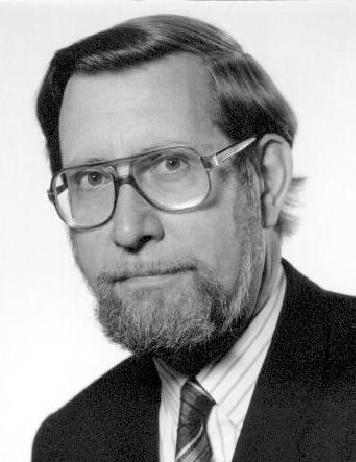

## Michael Duff

The BMVA is very pleased to announce that its first Distinguished Fellow is
Professor Michael Duff, FIEE, FIAPR, FRSA, from the Physics Department of
University College London.

Professor Duff started his career as a physicist in the 1950s and, like most
physicists of the time, he was spending his time looking at images of the
bubble chamber, chasing exotic particles. Unlike most physicists, however,
when it became obvious that the computers of the time were not powerful enough
for anybody to do any serious image processing with them, he set off to build
his own computer! Thus a brilliant career in computer architectures
started. The first outcome of his work was UCPR1 in 1967, which was based on
ideas evolving from studies of mammalian vision and in particular on models of
the retinal architecture.

Over the following two decades, heading the UCL Image Processing Group, he
developed these ideas with the series of eight increasingly complex
multiprocessor systems, generally categorised as Cellular Logic Image
Processors (CLIP0 to CLIP7), ranging from arrays of 25 to 9216 processors. One
of these, CLIP4, was put into commercial production. The CLIP programme was
given the British Computer Society Technical Award for 1985. In recent years,
this project has developed into various studies of computer architectures
based on nanoelectronics, funded by DARPA and the European Community.

During all this period, his work on computer architectures was accompanied by
studies in parallel algorithm design and applications to real problems in
applied image processing.

However, the contributions of Professor Duff do not stop here. In 1967 he
founded a discussion group on Pattern Recognition, which in 1976 developed
into the _British Pattern Recognition Association_. It was this Association
which in the mid-1980s joined forces with the then Alvey Vision Club to form
the BMVA as you know it today. Throughout all these years, Professor Duff has
been working in raising the profile of the UK community in the international
scene by being an active member of IAPR (to which BMVA is affiliated). He has
served as the secretary of IAPR for four years and as its president from 1990
to 1992. He has been chairing or is member of various IAPR committees and for
a few years from 1998 he was the IAPR newsletter editor.

BMVA this year proudly honours him with the Distinguished Fellow title.
