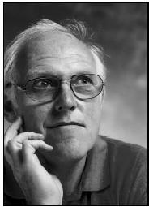

## Michael Brady

From pure mathematics, to computing and to robotics, Mike Brady's life has
spanned three continents and a trail of successes!  A fascinating story of
quest and discovery that started by being an anonymous undergraduate in UMIST,
and ending up as Professor Michael Brady, FRS, FREng, BP, and a few other
strings of letters that fade in comparison!

Mike Brady obtained his Mathematics degree from Manchester in the
mid-sixties. He must have been really determined and known what he wanted from
life in order to move to the other side of the world in order to do his PhD,
given that there must have been plenty of PhD opportunities in any of the UK
universities. Nevertheless, the young Mike Brady went all the way to Australia
to work under the supervision of Bernard Neumann and obtained his PhD in pure
Mathematics in less than 3 years, from the Australian National University.

But the quest was not over: pure Maths is beautiful, but there must be
something equally beautiful which is closer to real problems in life.
Computers started looking exciting at the time, and the idea of building a
machine that can reason fascinated the restless mind of the young Doctor of
Philosophy. He found a copy of the proceedings of a computer conference and
wrote to all participants asking for a postdoctoral position. He had 7
positive responses out of the 70 letters he wrote, one of them a lectureship
at Essex University to teach Computer Science, having never seen or used a
computer till then! Five years later he was publishing his first book,
//Theory of Computer Science//! The idea of building a machine that can reason
was still in the forefront of his quest and his first success was a system
that could read hand-written Fortran programming sheets.

With his first book out, Mike set off for a homage to the shrine of
Engineering, the MIT lab. It would have been difficult to go to MIT at the
time and not be awed by the American might: the average graduate student had
at his disposal more computing power than the whole of Essex University! The
place was a hive of activity in research. It was _the_ place that made things
happen! Mike went for a sabbatical year and stayed intermittently for almost
10 years. At last he could build machines that could see and reason. Mike was
happy in his robotics lab at MIT, until a telephone call from Oxford in 1985
put him on the spot: staying at MIT, or taking up the challenge to start from
the beginning again and build his own robotics lab in Oxford. Fortunately for
the UK, Oxford won: in 1985, Mike left MIT to take up the newly created
Professorship in Information Engineering at the University of Oxford. At
Oxford he founded the Robotics Laboratory and the Medical Vision Laboratory
(MVL).

Nowadays, he combines his work with a range of entrepreneurial activities:. He
serves as a non-executive director on the Boards of Directors of Oxford
Instruments, AEA Technology, and, until recently, Isis Innovation (Oxford
University's intellectual property company). He is a founding Director of the
start-up companies Guidance and Control Systems, Oxford Medical Image Analysis
(OMIA), and Oxford Intelligent Visualisation and Analysis (OXIVA). Shortly he
will be taking up the Directorship of the recently announced EPSRC/MRC
Inter-disciplinary research consortium entitled _From Medical Images and
Signals to Clinical Information_.

In addition, he has authored or co-authored over 250 articles in computer
vision, robotics, medical image analysis, and artificial intelligence. He is
author or editor of nine books, including: _Robot Motion_ (MIT Press 1984),
_Robotics Science_ (MIT Press 1989), _Robotics Research_ (MIT Press 1984), and
_Mammographic Image Analysis_ (Kluwer, January 1999). He is the editor of the
Artificial Intelligence Journal, and a founding editor of the International
Journal of Robotics Research. He is a member of the Editorial Board of
fourteen journals, most recently of Medical Image Analysis.

Professor Brady was elected a Fellow of the Royal Academy of Engineering (UK)
in 1991 and a Fellow of the Royal Society (UK) in 1997. He is a Fellow of the
Institution of Electrical Engineers and a founding Fellow of the Association
of Artificial Intelligence, and a Fellow of the Institute of Physics. He is a
member of the _Conseil Scientifique de I'INRIA_ in France. He has been
awarded honorary doctorates by the universities of Essex, Manchester,
Liverpool, Southampton, and Paul Sabatier (Toulouse). He was awarded the IEE
Faraday Medal for 2000 and the IEEE Third Millennium Medal for the UK. He is
the 2001 BMVA Distinguished Fellow!
