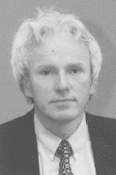

## Josef-Kittler

Starting from a provincial town in Czechoslovakia and making it as one of the
top professors in the Western world is an epic of coincidence, adventure and
achievement! When the Russian tanks entered Prague, Josef Kittler was an
undergraduate student of Radio Electronics at the Czech Technical University
in Prague, and found himself on a brief visit abroad.

That summer Josef came to the United Kingdom to spend his holidays doing
voluntary work in a hospital in Northern Ireland. Faced with the sudden
overcrowding in his native country he decided to continue his education in the
UK. However, before being able to resume his studies, he had a major task to
accomplish: he had to learn the language of his new country. One year after
the Prague Spring had ended, Josef Kittler was accepted as a final year
student in the Engineering Department of Cambridge University.

He did well enough to be accepted as a PhD student in the Control Engineering
Group headed by Professor John Coales FREng, to work on the topic of
Statistical Pattern Recognition under the supervision of Professor Peter
Young.

From then on, his academic life has been a series of successes and triumphs:
his PhD in 1974; his book in 1982 published by Prentice Hall being considered
for years the 'Bible' of Statistical Pattern Recognition; his SERC fellowship
at Cambridge; his Royal Society European Research Fellowship at _Ecole
Nationale Superieure des Telecommunications_, Paris; his IBM and subsequent
Rutherford Research Fellowships at Oxford; his job with Rutherford Appleton
Lab; and finally his Readership at Surrey University in 1986 with the task to
set up research in the area of Pattern Recognition and Machine
Intelligence. He achieved all this, and set up one of the most successful
groups in the country, managing to raise some &pound; 9,000,000 in grants over
the years, produce more than 500 publications, more than 150 of which were in
journals, edit several books, chair many committees, sit on the editorial
boards of several journals, offer consultancy to many companies and finally
set up his own spin-off company, _OmniPerception Ltd_, in 2001 to exploit his
research output in Biometrics.

His professional activities and successes were rewarded by many scientific
honours he has received: ScD by Cambridge in 1991, 'Honorary Medal' from the
Electrotechnical Faculty of the Czech Technical University of Prague in 1995,
honorary Doctorate by Lappeenranta University of Technology in 1999, elected
president of the International Association of Pattern Recognition in
1994--1996, IAPR Fellow in 1998, Fellow of the IEE in 1999, Fellow of the
Royal Academy of Engineering in 2000, IEE Achievements Medal for outstanding
contributions to visual information engineering in 2002, Fellow of the
Institute of Mathematics and its Applications in 2003, and Distinguished
Fellow of the BMVA in 2002.
