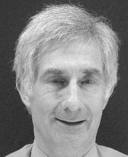

## Chris Taylor

Chris Taylor has been involved in Image Analysis and Computer Vision since
beginning his PhD in 1967. He originally came to Manchester to do a Degree in
Physics in 1964, and has remained ever since.  From the beginning he was
involved in developing novel hardware and software for Image Analysis. His
PhD, entitled _General Methods of Analysing Biomedical Images_, involved
building image digitisation equipment and writing segmentation software on a
DEC PDP8.

On completing his PhD he became an RA, and soon a Lecturer in the Department
of Medical Biophysics. Since at the time there was little commercial equipment
available, he was involved in developing integrated software and hardware
systems for image acquisition and analysis. With colleagues he designed and
built the Magiscan 1 and 2, which used custom built microprocessors to achieve
extremely fast processing speeds -- it was not until the mid-90s that
general-purpose computers began to achieve similar speeds. The Magiscans
formed an important commercial product for Joyce-Loebl Ltd, an industrial
collaborator.

In 1977 he became Manager of the newly formed Wolfson Image Analysis Unit,
which aimed to develop sophisticated image analysis applications for the
Magiscan machines. The Unit developed pioneering chromosome analysis systems,
an asbestos counting system that was adopted by the Health and Safety
Executive as a standard and a system for inspecting brake assemblies which
remained in continuous use on a VW production line for over 10 years.

In 1990 he was awarded a chair, becoming a Professor of Medical
Biophysics. His interests turned to using trained statistical models to
interpret images. His group's pioneering work on statistical models of shape
and appearance has proved very influential. Papers about the work have won
numerous prizes and the approaches have been adopted internationally. Chris
has been keen to ensure that computer vision is used to solve real problems,
has been involved in numerous collaborations with industry, and has formed
several spin-off companies including Kestra Ltd (industrial inspection),
imorphics Ltd (medical image analysis) and Genemation Ltd (facial modelling).

As well as his research work, he has been very active in promoting the subject
of Computer Vision. He has been active on many committees and associations
involved in healthcare and computer vision. In 1988 he became Chair of the
British Pattern Recognition Association, and was instrumental in the merging
of that organisation with the Alvey Vision Club to form the BMVA
in 1990. Chris was the first Chairman of the BMVA, and has been closely
involved ever since. He remains the Company Secretary.

In 2000 he was awarded the OBE for services to health and his work on the
Foresight committees. He has recently become the Head of the School of
Computer Science at the University of Manchester.
