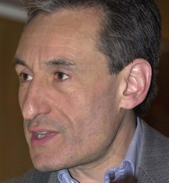

## Andrew Blake

The title of 2004 BMVA Distinguished fellow was awarded to Andrew Blake, of
Microsoft Research, Cambridge.  Professor Blake has been a leader of UK
computer vision research for many years, and is one of our most
internationally renowned researchers.  His many contributions span the field
from psychophysics to tracking (the 'condensation' algorithm being a
particular milestone) to robotics, and now include the area of machine
learning applied to vision.

He graduated from Trinity College, Cambridge in 1977 with a BA in Mathematics
and Electrical Sciences. After a year as a Kennedy Scholar at MIT and two
years in the defence electronics industry, he studied for a doctorate at the
University of Edinburgh, and this was awarded in 1983. Until 1987 he was on
the faculty of the Department of Computer Science at the University of
Edinburgh and was a Royal Society Research Fellow. From 1987 to 1999 he was on
the Faculty of the Department of Engineering Science in the University of
Oxford, where he ran the Visual Dynamics Research Group, became a Professor in
1996, and was a Royal Society Senior Research Fellow for 1998-9. In 1999 he
moved to Microsoft Research, Cambridge as Senior Research Scientist, leading
the Vision Group. He was elected Fellow of the Royal Academy of Engineering in
1998 and Fellow of the Royal Society in 2005.

He has published several books including _Visual Reconstruction_ with
A. Zisserman (MIT press), _Active Vision_ with A. Yuille (MIT Press) and
_Active Contours_ with M. Isard (Springer-Verlag). He has twice won the prize
of the European Conference on Computer Vision, with R. Cipolla in 1992 and
with M. Isard in 1996, and was awarded the IEEE David Marr Prize (jointly with
K. Toyama) in 2001. He has served as programme chair for the International
Conference on Computer Vision in 1995 and 1999, and is on the editorial boards
of the journals Image and Vision Computing, International Journal of Computer
Vision and Computer Vision and Image Understanding.

We are honoured to add Professor Blake to the list of BMVA Distinguished
Fellows.
