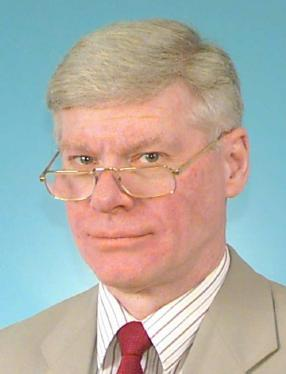

## Roy Davies

The title of 2005 BMVA Distinguished Fellow was awarded to Roy Davies,
Professor of Machine Vision at Royal Holloway, London. Professor Davies has
been a leading figure in the areas of image processing and computer vision
since the mid-1980s and has contributed greatly to both the field and the
community.

He was educated at Cardiff High School and Jesus College Oxford. He obtained
his BA in Physics in 1963 and his DPhil in 1967. The title of his thesis was
_Electron and Nuclear Resonance Studies in Solids_.  Roy's early career at RA
level was based on spin transitions for nuclei and the related electronics,
leading to the development of the 'Davies Electron-Nuclear Double Resonance'
technique, better known as the 'Davies ENDOR' technique, a method that 32
years later is still regularly referenced in Physics journals. His interest in
electronics, noise, and signal extraction or recovery led to a book which
integrated the entire area. The book, _Electronics, Noise and Signal
Recovery_, published in 1993, very neatly encapsulated the essence of the
various courses taught by Professor Davies at Royal Holloway over the years.

The book for which Professor Davies is most well known to computer vision
students, researchers, and academics all around the world is the one now in
its 3^rd^ Edition: _Machine Vision: Theory, Algorithms, Practicalities_,
originally published in 1990.

Professor Davies' combined interest in image analysis and real-time systems
has kept him in popular demand by industry for investigating industrial vision
problems. Indeed, over a fair period of time a large proportion of his
research funding has come from grants related to food inspection. This led to
his third book in 2000, _Image Processing for the Food Industry_.

Overall, Professor Davies' career has been involved with making sense of data,
and not just images, and in part by negotiation of noise and clutter in a
systematic way. His DSc awarded by the University of London in 1996 reflects
this major preoccupation.

Professor Davies' authority, popularity, and standing in the community are
unbounded and this is reflected by the simple fact that he has examined around
100 PhD students. He has served the vision community through his tireless
participation in the BMVA, the IEE, and on many editorial boards (Pattern
Recognition Letters, Real-Time Imaging, _etc_) over the years.

The BMVA is privileged to add Professor Davies to its list of Distinguished
Fellows.
