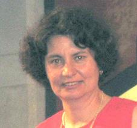

## Maria Petrou

The recipient of the 2006 BMVA Distinguished Fellowship is Maria Petrou,
Professor of Signal Processing and the Head of the Communications and Signal
Processing Group in the Electrical and Electronic Engineering Department at
Imperial College London.

Maria obtained a BSc in Physics in 1975 from the Aristotelion University of
Thessaloniki, Greece where at the entrance tests of the university she
obtained the top mark amongst 4000 candidates for all Science and Engineering
Departments in Greece. She went on to do the Part III, Mathematical Tripos at
the University of Cambridge in 1977, continuing there to obtain a Ph.D. in
Astronomy in 1981. Until the age of 12 Maria had wanted to be an Astronaut, so
clearly she settled for an Astronomer instead!

Following academic posts at the Kapodistrian University of Athens and at the
University of Oxford and Reading, Maria then spent 17 years at the University
of Surrey, from Lecturer through to Professor, moving to her current post at
Imperial College recently in 2005. She is a Fellow of IEE, a Fellow of the
IAPR, and a Fellow of the Royal Academy of Engineering. These days Maria
describes herself as a Physicist by training, an Engineer by profession and a
Mathematician at heart!

Today Maria's research interests include many topics in Image Processing,
Computer Vision and Pattern Recognition and her contributions to these areas
have been immense. She has won several million pounds in grants for her
research. She has published more than 250 papers with more than 100 in
refereed journals. She has written two books on Image Processing: The first
one was printed in 1999, reprinted twice since, and translated into Chinese
in 2006. The second edition is in preparation. Her second book on Texture was
published in 2006. Both books are self-contained and wholly structured around
a series of questions and answers.

Like all great scientists, Maria is not just consumed with research and she
loves teaching. In fact, she has loved teaching from an early age, starting
professionally at 15, tutoring pupils and students in maths.  Her first fee
was 50 cents an hour. At some stage, while at University, she used to teach
arithmetic to a 7 year old, crystallography to her fellow students, and
Ancient Greek to a 16 year old! Once she even taught Trigonometry to a 16 year
old Arab student, using an Arab text, without her knowing Arabic (and the
student good English)! Even the Q and A style of her two books are testament
to her love of teaching in an easily communicative, no nonsense fashion.

Maria has served the national and international vision community through her
tireless participation for many years. She has been IAPR Newsletter editor for
5 years, IAPR treasurer for 4, BMVA Chairman for 3, BMVA/EPSRC Summer School
Organiser for 5, plus numerous other activities, like member of the GB of IAPR
and member of the Executive Committee of the BMVA for several years, and
several editorships and editorial boards of journals. Most recently she became
a trustee of IET.  She has supervised 36 PhD theses to successful completion
and she has examined nearly 100.

The BMVA is proud to award a Distinguished Fellowship to such an inspiring
colleague...Professor Maria Petrou.
