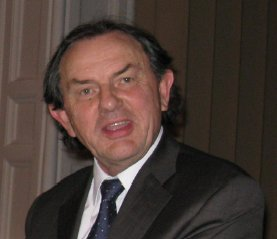

## Bill Adaway

It is an honour to be presenting Bill Adaway with the BMVA Distinguished
Fellowship award. Many of you may not have heard of Bill, but I have no doubt
you have been captured, maybe even fined, by one of his cameras! Let me first
give you some facts:

After spending several years working for Ferranti and then Thorn EMI, Bill
founded Computer Recognition Systems in 1981. CRS is based in Wokingham in
England and it is now a worldwide trading company with offices in the UK, US,
and Malaysia. Employing 80 staff, CRS, together with its subsidiary Davin
Optronics, provides world class imaging systems development and manufacturing
capability, and supplies optical and electro-optical equipment to military,
industrial, medical and transportation markets.

Bill’s research activities include all aspects of outdoor machine vision
concerned with wide area surveillance, object tracking and automatic
numberplate recognition including illumination, optics, algorithms and
processing. His company has the majority share of the market in the UK for
extremely versatile and accurate motorway and city-centre traffic speed
monitoring, for example the yellow average-speed cameras along roadworks on
Britain’s motorways --- a prime example of image analysis in action.

Bill played a key role in establishing the BMVA, bringing an industrial
perspective to discussion of its scope and objectives, and took up a place as
a founder member of its executive committee. Following the formation of BMVA
and the merging of Alvey Vision Club annual meetings and BPRA’s international
meetings to create BMVC, he acted as a regular member of the programme
committee, taking on a very substantial refereeing load. During this period
BMVA worked hard to improve both the academic quality and industrial relevance
of BMVC, and Bill brought a unique and invaluable perspective.

Over a very long period now, Bill has been one of the most prominent and
consistent examples in the UK of someone at the 'sharp end' from industry
engaging actively and intelligently with the academic machine vision
community, contributing both to its development and to encouraging knowledge
transfer. Bill has also played, for many years, an active role in advising
funding bodies (particularly DTI and EPSRC). One outcome of his advocacy for
the relevance of academic research to industrial practice (and vice versa) has
been EPSRC and DTI support both for specific projects and for broad programmes
of joint research.

On top of his direct services to the machine vision community, Bill is also a
beacon of success in taking state-of-the-art vision algorithms, and building a
successful business --- something we ought to honour in its own right.
