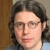

## Andrew Zisserman

Andrew Zisserman FRS graduated from the University of Cambridge with a degree
in theoretical physics and Part III mathematics. After PhD work in physics, he
saw the light in 1984 and began to work on computer vision at Edinburgh
university, as part of the Alvey project, the scheme to which we can also
trace the beginnings of BMVC. His work with Andrew Blake on the problem of
surface reconstruction produced a book, "Visual Reconstruction", which remains
one of the seminal works in the field.  The book was one of the first
treatments of the energy minimization approach to include an algorithm (called
"graduated non convexity") designed to directly address the problem of local
minima, and furthermore to include a theoretical analysis of its
convergence. This work epitomizes the characteristics of Zisserman's research:
deep mathematical understanding coupled with an unbending desire for practical
results. It's easy to create impressive-looking mathematics if you don't need
to show it has a practical relationship to the real world. Zisserman's
mathematics is never difficult for the sake of difficulty, but is firmly
grounded in real problems in the real world.

Moving to Oxford in 1987, to join Mike Brady's newly founded robotics group,
he began to work on what was to be come one of the major movements in the
field of computer vision: multiple-view geometry.  Initially interest was
focussed on geometric invariants, with an emphasis on object recognition, and
it was for object recognition that he first won the IEEE Marr prize
in 1993. Again, powerful mathematics was brought to bear on real-world
problems, moving on to 3D structure and motion recovery from image sequences
(and even single images), with demonstrations on real data which were the envy
of computer-vision conference attendees for a decade. Two more Marr prizes
followed, as well as a clutch of other awards, and of course the famous book
with Richard Hartley, which is probably on the bookshelf of almost everyone in
our field. Software from his research group was developed by the spin out
company 2d3 as a camera tracker for the special effects industry.  This was
awarded a Technical Emmy Award in 2002.

Geometry was successful in showing that computer vision could solve problems
which humans could not: recovering 3D structure from multiple images required
highly trained photogrammetrists and took a considerable amount of
time. However, Andrew's interests turned to a problem where a six-year old
child could easily beat the algorithms of the day: object recognition. Leaving
geometry to the rest of us to fill in the gaps, he devoted himself
wholeheartedly to the problem. Taking some tools from the geometry days, and
new ideas from information retrieval and machine learning, his group has
repeatedly heightened the bar on what computers can achieve. From the seminal
"video google" work in 2003, through the formalization of the recognition
performance assessment via the Pascal challenge, he continues to drive the
field forward.

His election to the fellowship of the Royal Society in 2007 recognized his
status as one of the pathfinder stars of the field of computer vision. I am
honoured to announce therefore that Andrew Zisserman is the 2008 recipient of
the Distinguished Fellowship of the British Machine Vision Association.

| Andrew Fitzgibbon
| BMVA Chairman
