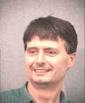

## Bernard Buxton

Professor Bernard Buxton's web page is a modest affair, belying the powerhouse
of activity that is its author. He has, at the end of 2009 one of the UK's
largest academic portfolios as UCL's Dean of Engineering, with responsibility
for approximately two hundred academic staff, and a financial turnover of £60M
p.a. Under his deanship, UCL has moved from being an internationally highly
respected Engineering school to being in the very top international league.

He started as a physicist, studying at the Cavendish laboratory in Cambridge,
and then at the H H Wills laboratory at the University of Bristol where he
completed his PhD with (now Sir) Michael Berry, and worked at both
institutions before joining the Long Range Research Laboratory at GEC in 1981
as one of its first staff. While there he authored some very important papers
in particular with David Murray on Markov random fields (MRFs), one of the key
tools in modern computer vision. While researching diverse areas from
development, with colleagues at the Silsoe Research Institute, of an
agricultural robot vehicle for the precision spraying of brassica (cabbage)
seedlings to energy optimization, from aspects of biological perception—often
in collaboration with his wife, Hilary Buxton (who herself rose to hold a
Chair at the University of Sussex and be subject chair of COGs, their unique
Computing and Cognitive Science Department), to tangling with the trifocal
tensor, contributing to bioinformatics (with David Jones) and to
multi-classifier fusion and data mining (with Bill Langdon—now back at UCL—and
Stephen Barrett of GSK) he was also a keen enthusiast for the promulgation of
computer vision, playing key roles in the founding of BMVC, ICCV, and in the
founding and early running of ECCV. It is in no small part thanks to Bernard
that these conferences represent the pinnacle of our field, and indeed have
prestige matching the best journals.

His international collaborations continued through large UK and EU projects,
both at GEC and beyond, notable among these being the early UK Alvey project,
“Spatio-temporal processing and optical flow for computer vision”, and the EU
projects, “DMA”, “VOILA” and “RTGC” (Real-Time Gaze Control). In 1994, Bernard
became Professor of Information Processing Systems in the Department of
Computer Science at UCL where, with Simon Arridge and the arrival of Mel
Slater from QMUL (QMWC as it then was) established and led the Vision, Imaging
and Virtual Environments research group, which grew to become the largest in
the Department, with over £5M of funded research by the turn of the
millennium.

What is perhaps most notable about Bernard, however, is the enthusiasm with
which he mentors young researchers. Postgraduate education, in particular of
research students, has been one of Bernard’s abiding passions, from his early
days as a physicist at both Bristol and Cambridge Universities through to UCL,
the latter tempered in particular by his industrial experience and view from
the ‘other side’ as it were, at GEC. A particular example close to home is his
involvement in establishing, with EPSRC support, the BMVA Summer School and
contributing to it for ten years with his unique lectures on image
modelling. His founding, with Simon Arridge, of the vision and graphics
masters at UCL, now in its 15th year, has contributed hundreds of highly
trained and highly motivated alumni to the world computer vision community,
further enhancing the international reputation of UK computer
vision. Furthermore his PhD students are academics throughout the world, and
indeed we are lucky in the UK when we are able to retain some of them, so
great is the value of a Buxton education.

As chairman of the British Machine Vision Association, an organization of
which he was one of the founding fathers, it therefore gives me very great
pleasure to announce that Bernard Buxton is our 2009 Distinguished Fellow.

|  Andrew Fitzgibbon
|  BMVA Chairman
