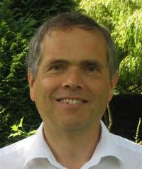

## David Hogg

David Hogg is one of those researchers who not only does amazing work, but
often did the work 20 years before anyone else. His thesis, for example, is on
human body tracking in 2D images, a very hot topic in vision these
days. However, he addressed the problem fully 30 years ago, on machines with
clock speeds a thousand times slower than today's.  Looking at his thesis, it
is amazing how every chapter could be a paper in a modern vision conference:
direct 3D model fitting with clever search strategies, multiple person
tracking, branch-and-bound for efficiency. Later work on hand tracking,
modelling from silhouettes is just as relevant today as it was when it was
done. [See the video](??)

To begin near the beginning, David studied applied mathematics at the
university of Warwick in 1975, and then went to Canada, obtaining a master's
in computer science from the University of Western Ontario the following
year. Coming back to the UK, he took his PhD at the university of Sussex,
completing in 1984. He remained at Sussex for several years, looking at a
variety of AI and computer vision problems, and co-authoring the AI textbook
“Computers and Thought”. In 1990 he moved to Leeds, as head of the division of
artificial intelligence. The group at Leeds went from strength to strength
under his leadership, with hundreds of influential publications in the
succeeding years. Particular favourites of mine are the deformable shape
recovery work of Shen and Hogg (1994), and the deformable hand tracking of
Heap and Hogg (1996).  In 2000, he took on the role of Pro-vice-chancellor at
Leeds, and spent four years in university administration: the vision
community’s temporary loss was the university’s great gain. His return “to the
fold” in 2005 was marked by further expansion of the Leeds group, and he
co-chaired CVPR 2010. He continues to devote considerable time to his rôle as
one of Leeds's three Pro-Vice-Chancellors: his office being responsible for
Research and Innovation, promoting the University's research agenda.

Everyone you talk to about David, as well as admiring the quality of his work,
also describes him as one of the nicest people you could meet. He has
selflessly helped many researchers in their careers (including myself), and
has contributed greatly to computer vision in the UK and worldwide. For all
these tremendous contributions, it is therefore my very great pleasure to
announce that David Hogg is the recipient of the 2011 Distinguished Fellowship
of the BMVA.

|  Andrew Fitzgibbon
|  BMVA Chairman
