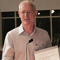

## John Illingworth

At BMVC 2012, the conference T-shirts were designed around the theme of 23
years of BMVC and the Alvey Vision Conference before it. Thus we might think
of computer vision in the UK has having “gone mainstream” about 23 years
ago. One of the key contributors to UK computer vision throughout those
decades has been John Illingworth. Like many computer vision researchers in
those days, John began life a physicist. He read physics at Birmingham
University, and then came to Oxford to study for his doctorate in the
department of Particle Physics. Finishing his thesis, he moved in 1983 to the
Rutherford Appleton Laboratory, where he met Josef Kittler, and beginning to
think about the true path of research: computer vision.

He arrived for his first day of work at RAL rather wet behind the ears, not
because he was inexperienced, but because he had heard a commotion in the
river outside his house, and had dived in to the Thames at 3AM to rescue a
drowning man. I realize that the award we are bestowing tonight cannot compete
with the medal for bravery that he was awarded by the British Humane
Association on that occasion, but I hope that we will at least come close.

As I said, his time at RAL signalled the movement from physics to computer
vision. He produced several very influential articles over the next decades,
generating many thousands of citations, some of which are very relevant today
with the rediscovery of the power of the Hough transform, and I strongly
recommend a read of his articles from those years ago. If you think you’ve
come up with a way to fix some difficulty with the Hough transform, I’m quite
confident that you’ll find it in Illingworth’s papers if you haven’t already
read them.

When I started my career 20 years ago, I did a Master’s project on the Hough
transform, and to me Illingworth was some sort of supreme being, so I was awed
to meet him in person when we worked on a joint project together, and indeed I
recall it was John who gave me encouragement to develop the idea which led to
my very first paper, in 1992. John’s lifesaving skills also came in useful
when we both attended a conference in Boston that year, and some rather large
American sportsmen took issue with my hair, which was then rather more blue
than it is today.

John moved to Surrey in 1987, at the same time as Kittler, working on all
aspects of range data interpretation and 3D modelling. Working with Terry
Windeatt, Adrian Hilton, Andrew Stoddart, among many others, Surrey became a
powerhouse of computer vision, and John was promoted to a personal chair
in 1999. Since then he has continued to publish widely in many areas of
computer vision, and you can tell from his wide range of collaborators how
collegiate a researcher he is. His colleagues describe him as someone who
always has an eye out for other people, guiding them at every stage of their
careers.

John has also contributed tremendously to the BMVA over the years: he
organized BMVC here in Surrey in 1993, was chairman of the organization for
several years, and he was the driving force behind the establishment of the
Computer Vision summer school which has now been running for over a decade. He
is a Fellow of the Institiution of Electrical Engineers and is a co-editor of
the IEE journal Vision, Image and Signal Processing. I am honoured to name him
as the BMVA Distinguished Fellow for 2012.

|  Andrew Fitzgibbon
|  BMVA Chairman
