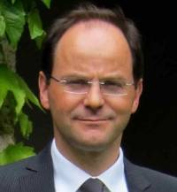

## Roberto Cipolla

Roberto Cipolla is often regarded as a great Italian computer vision
researcher who has based his work in the UK, but in fact he grew up in
Solihull, so is truly home-grown. He studied undergraduate engineering at
Cambridge engineering, and then went to the University of Pennsylvania where
his Master's thesis (1985) was on radar signal processing. A love of the films
of Akira Kurosawa, and the dream of what was then called "5th Generation"
robotics brought him to Japan, to the famous
[Electrotechnical Laboratory](http://www.aist.go.jp/aist_e/about_aist/history/history.html
"wikilink").  There he met some of the greats of computer vision: Ikeuchi,
Kanade, Asada. They were doing pioneering work in 3D vision, and Roberto
immediately saw the potential to apply that work to the difficult problem of
analysing human motion, the subject of a further MEng. For his PhD, the ETL's
greats had heard that Brady, and then Blake, were soon to arrive in Oxford,
and it was there that Roberto completed his PhD on 3D reconstruction from
smooth 2D contours, an immensely difficult problem to which Cipolla has
contributed much of the seminal work, including the excellent monograph with
Peter Giblin, "Visual Motion of Curves and Surfaces", to which I still refer
frequently.

Starting as a lecturer at the Cambridge Engineering department in 1992,
Roberto immediately became remarkable for the quality of the work he was
doing. A stream of top-notch papers came from this new research group, making
the result of the world sit up and take notice. The range of topics was
impressive: Multiple-view geometry; Model-based tracking; Reconstruction and
recogntion of architecture; Object recognition; and of course analysis of
images of humans. From face recognition to hand tracking to 3D body modelling,
Cipolla's group's work was certainly a key source of inspiration for my
colleagues when we began work on human body tracking for Kinect for
Xbox 360. All the work from Roberto's lab combines the best characteristics of
great research: taking hard problems, and creating compelling solutions which
display mathematical elegance, great depth of understanding, and strong
practical engineering. He always has some amazing new demo to show on his
laptop (or indeed nowadays on his phone), and is full of excitement both at
the theoretical advances that it embodies and the real-world benefits it can
bring.

Of the thirty or so PhD students he has graduated since he began at Cambridge,
I count it that fourteen are now academics at major institutions across the
world, and many of the remainder are among of the most highly regarded
industrial academics in computer vision. This mentoring of PhDs continues with
his highly regarded series of computer vision summer schools, held in Sicily
every year. A place at the school is highly prized, not least because of the
stellar field of international experts Roberto assembles every year. Indeed I
would suggest that not only are places prized by the students, but also by the
lecturers.

In parallel, his continuing interest in Japan (including a year-long visit to
Toshiba just after his PhD) led to the founding in 2006 of the computer vision
group at Toshiba's Cambridge Research Lab, and in 2007 Roberto was appointed
Lab director. Real-world applications also underpin the spinout companies that
have emerged form his lab. To name just two: Metail is already revolutionizing
online clothes shopping, and Zappar is a winning take on the much-talked-about
technology of virtual reality.

He has received many recognitions for his work: he became a Reader in
Information Engineering in 1997 and a Professor in 2000, and in 2010 was
elected a Fellow of the Royal Academy of Engineering. It is with great pride
and delight then that I name him the 2013 Distinguished Fellow of the BMVA.

|  Andrew Fitzgibbon
|  BMVA Chairman
