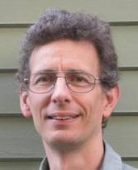

## Tim Cootes

The BMVA Distinguished Fellow for 2014 is Tim Cootes. Early on in its
deliberations, the Distinguished Fellow Panel was astounded to see the
citation rates for some of Tim’s best-known papers, including one which had in
excess of 5000 citations! This naturally made him a very strong contender,
though of course the award is more about real achievements than about simply
numbers.

Many of the major techniques in computer vision --- such as those of Canny,
Harris, and Viola and Jones -- have huge numbers of followers. It is a
pleasure to record that the same applies for the ground-breaking shape
analysis techniques of this year’s Distinguished Fellow. Indeed, the
statistical shape and appearance models that he developed have been a mainstay
of our armoury for over two decades. Importantly, once one has understood how
active shape models work, it is difficult to think of any other way of
modelling shape statistically.

Tim’s background was in Maths and Physics, and his PhD was about modelling
vortices in sewage! He carried out his seminal work on shape models shortly
after joining Manchester in 1991, initially through research grants and later
via research council fellowships. He became a member of the permanent academic
staff in mid-2001 and rose quickly to become Professor of Computer Vision
in 2006.

Tim’s recent work explores the difficult problem of finding and aligning
corresponding points in groups of images. Although the primary focus of Tim’s
work is in the medical domain, he has also made contributions in face
recognition. In fact, one of Tim’s face models has even been seen on pop
videos!

Tim has also had a major involvement with the BMVA: for a few years he looked
after publicity before acting as BMVA chair from 2002 to 2005. He also
co-chaired the annual student papers meeting before it was moved to BMVC. Last
but by no means least, Tim achieved the accolade of being awarded Fellow of
the IAPR in 2010.

It is with great pleasure that we name Tim Cootes the BMVA Distinguished
Fellow for 2014.

| Adrian F Clark (BMVA Chair)
| Roy Davies (DF Panel Chair)
