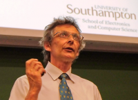

## Mark Nixon

Mark Nixon is Professor in Computer Vision in the School of Electronics and
Computer Science at the University of Southampton. When you hear Mark's name,
the thing that you associate most closely with it is the analysis of gait ---
the way people walk. His early work attracted DARPA funding, almost unheard of
for a UK institution, where it was used to explore how to identify individuals
at a distance. Their gait recognition work --- and the psychedelic tunnel
along which people walk to have their gait captured --- appeared in the very
first episode of the BBC science programme _Bang Goes the Theory_.

However, this was not Mark’s initial foray into early research on
biometrics. He and his colleagues –-- notably John Carter --- were early
workers on face recognition and later went on to join the pioneers of ear
biometrics. Subsequently, he has explored the fusion of biometrics and is now
exploring how biometrics can be spoofed --– and hopefully, how spoofed
biometrics can be countered. He has given many invited and plenary talks on
biometrics at conferences and meetings; many of these are available online and
are well worth listening to. Along the way, Mark has developed new techniques
for static and moving shape extraction, both parametric and non-parametric. As
well as applying this to biometrics, these techniques have found application
in medical image analysis.

Mark has not been entirely idle outside the narrow constraints of performing
academic research. He chaired the 9th BMVC, which was held at Southampton in
September 1998, and went on to co-chair the IAPR International Conference on
Audio-Visual Biometric Person Authentication (AVBPA 2003). In the following
year he was Publications Chair for the International Conference on Pattern
Recognition (ICPR 2004) at Cambridge. He also co-chaired the 7th International
Conference on Face and Gesture Recognition, held at Southampton
in 2006. Mark’s vision book, Feature Extraction and Image Processing,
co-written with Alberto Aguado, remains a popular choice for vision courses
almost a decade after it first appeared. With Tieniu Tan and Rama Chellappa,
he wrote Human ID based on Gait, part of the Springer Series on Biometrics. He
and his colleagues wrote the survey on gait biometrics in Biometrics: Personal
ID in Networked Society, and the ear biometrics chapter in The Handbook of
Biometrics.

Mark has long been one of the BMVA’s representatives on the Governing Board of
the IAPR: there not only has he represented the UK’s interests but also he has
been involved in several of its committees.

It is with great pride and pleasure that we name Mark Nixon the BMVA
Distinguished Fellow for 2015.

|  Adrian Clark (BMVA Chair)
|  Roy Davies (DF Committee Chair)
