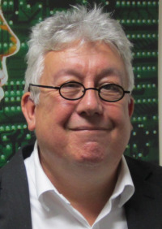

## Edwin Hancock

It is fitting that, in a year when the British Machine Vision Conference is at
York, the BMVA Distinguished Fellow should be Edwin Hancock. That is because
Edwin is a Professor in the Computer Science department at York, where he has
pursued a long and distinguished career. Like many vision researchers in its
early days, Edwin’s first degree and PhD are in Physics — he will explain in
his own words how he was bitten by the vision bug. Bitten he certainly was,
because he has published around 700 papers, encompassing areas such as graph
algorithms, shape from shading, texture, shape analysis, object recognition
and machine learning.  However, these are only part of Edwin’s
contribution. He has played a big part in journals and conferences, with a
long-standing involvement in Pattern Recognition in particular. He has also
been editor of the IET’s Computer Vision journal.

For the BMVA, Edwin’s most visible achievements have been chairing BMVC on its
first visit to York in 1994, and then representing the BMVA on the Governing
Board of the International Association for Pattern Recognition (the IAPR) for
well over a decade. However, behind the scenes, Edwin has consistently
provided sage and helpful advice to the BMVA’s Executive Committee for about
20 years. Edwin’s contributions have already been recognised. He held a Royal
Society Wolfson Research Merit Award during 2009–-2014, he is a Fellow of the
IAPR, the BCS, the IET, the Institute of Physics --— and now he joins the select
band of recipients of Fellowship of the BMVA.

|  Adrian F Clark (BMVA chair)
|  Roy Davies (DF Committee chair)

#### Acceptance Speech

Thirty years ago to the day, I was on a train travelling to Bristol to present
my very first vision paper at the Second Alvey Vision Conference.

About a year earlier I had switched fields from high energy physics to work
with Josef Kittler. At the time it seemed a bit of a step in the dark, and
perhaps even a step down from what seemed the more glamourous world of
particle physics. I had worked on the first experiment to measure charmed
particle lifetimes at SLAC (where the Physics Department had an infestation of
Nobel Laureates), my PhD grandfather had discovered the pion (and got the
Nobel Prize for it), the W and Z had been discovered 3 years earlier and the
Higgs was expected soon (or so they thought). I was off to mix in different
company for the first time.  Expectations were not high. But I was nervous –
this was to be my first conference presentation. In particle physics only the
bosses got to give talks.

We, on the other hand, manned night shifts running the apparatus, spent long
hours in darkened rooms visually scanning bubble chamber film, crawled inside
powerful magnets (which were too delicate to power off) and wrestled with a
pneumatic monster called the Hough-Powell (or huffpuff) device which
temperamentally scanned for particle tracks on film.

My move from particle physics had been made possible by the Alvey
Programme. This was a massive injection of cash into computing and AI, to
revive UK research in these areas. The subject of AI had been all but killed
off in the UK by the Lighthill Report, and Alvey was a desperate attempt to
breathe life back into it. The field of computer vision had done well, with
several well-funded long-term projects. The two largest of these were the
so-called IKBS 3D Vision Project, which comprised GEC, Edinburgh, Sheffield,
IBM and Sussex, and aimed to recover 3D shape from stereopsis and motion. The
second was MMI007, which aimed to recognise 3D objects from 2D images, and
comprised British Aerospace, Marconi, Bristol, Reading, RSRE and Surrey. The
two projects were presenting their first results at the conference, and
comprised a galaxy of talent including Andrew Blake, Hilary and Bernard
Buxton, Bob Fisher, John Frisby, John Illingworth, Josef Kittler, John Mayhew,
Dave Murray, Geoff Sullivan and Andrew Zisserman, to name just a few. Mike
Brady had just returned from MIT, and was on the lookout for new talent to
build a group at Oxford. The invited speakers were Shimon Ullman and Don
Geman.  Guy Scott won the best paper prize for his work on
structure-from-motion, and later moved from Sussex to Oxford to join Mike,
before embarking in a career in politics and becoming President of
Zambia. This was primordial mass of talent from which the UK vision community
was born, with its hallmarks of pragmatism and rigour. After all, the
conference was not so bad. They politely received my rushed and garbled talk,
too full of equations on handwritten overheads. Old habits die hard. They were
a convivial and irreverent lot who drank just as heavily as particle
physicists and managed to look bright eyed and bushy tailed the next day. Many
were also refugees from exciting but crowded areas of physics. I came across
graphs and shape-from-shading for the first time. As they say, be careful what
you allow into your head, it will find its way out one day.

I won’t bore you with details of the intervening thirty years (it’s
extensively documented in the literature). Twenty-eight of them have been
spent waiting for the Higgs to appear: twenty-five here in York. I cannot
believe how productive those years have been. This is of course due to the
patience, generosity of spirit and sheer braininess of my academic colleagues
and research students. Not just that, but their willingness to embark on
intellectual journeys into the unknown and the alacrity with which they
engaged with whatever challenges confronted us.

This fellowship is an exceptional honour, and if it is not a contradiction, I
do feel genuinely humbled, honoured and proud to receive it. It is of course a
distinction not just for me, but for the colleagues, and in particular
research students with whom I have worked over the years. Thank you very much
indeed.

|  Professor Edwin Hancock
|  University of York
