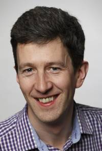

## Andrew Fitzgibbon

You often hear people being introduced on TV with the phrase that they "need
no introduction" --- and this is one of the few cases in the vision research
community where this is genuinely the case.

Our Distinguished Fellow for 2017 studied first at University College Cork,
then moved to Edinburgh where he contributed to, among other things, HIPR, the
first web-based vision teaching aid. He then received a Royal Society Research
Fellowship which took him to Oxford, where he most notably contributed to the
Boujou system, which won an Emmy award.  If you have seen a recent movie that
has real actors and CGI, you have probably seen the fruits of this work.

In 2005, our Distinguished Fellow moved to Microsoft Research, where he was a
major contributor to the development of the Kinect, which quickly became an
important vision capture device. He has recently been working on the Hololens,
which shows every sign as being as ground-breaking and important. However, our
Distinguished Fellow has not worked purely on development: he has amassed at
least ten best paper awards at major conferences, and also the silver medal of
the Royal Academy of Engineering and the BCS Roger Needham award. He is a past
chair of the BMVA Executive Committee, and it was at his instigation that BMVC
grew from a good national conference into the important international one that
it is today. He is a Fellow of the Royal Academy of Engineering, of the
British Computer Society and of the International Association for Pattern
Recognition.

Our BMVA Distinguished Fellow for 2017 is Andrew Fitzgibbon.

| Adrian Clark (BMVA chair)
| Roy Davies (DF Committee chair)
