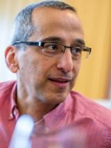

## Majid Mirmehdi

Every year, the BMVA awards a single Distinguished Fellowship to a person in recognition of their outstanding contribution to Computer Vision in the UK. These contributions might be in recognition of significant advances in an important technical area, or in a addressing a particularly difficult or long-standing problem, or in guiding and supporting the research community. I am pleased to say that this year's Distinguished Fellow, Prof Majid Mirmehdi, has made contributions in all these areas.

Like me, Majid first started publishing in the area of parallel computer vision, figuring out ways of making vision algorithms run quickly on transputers. He then worked on texture and its use in probabilistic frameworks before moving on to explore the use of computer vision as an inherent part of larger systems, often in the medical domain --- with papers on lung function, healthcare and assisted living published in the last couple of years. Back in the early 1990s, many of these applications would have seemed impossibly difficult, more fiction then aspiration, and the work of Majid has helped bring them to reality.

Despite these many and varied research contributions, our Distinguished Fellow is perhaps best known for his work in supporting the research community. He plays an important role in Bristol's Visual Information and Robotics Laboratories. He is editor-in-chief of the IET's journal, and an associate editor of and . He is an advisory editor of . Moreover, he has done these things while holding the significant roles of Graduate Dean and Faculty Graduate Education Director in his institution, so his commitment is clear for us all to see.

Majid has served on the BMVA's Executive Committee for approaching 20 years now, chairing the BMVA from 2005 to 2008. He has been heavily involved in staging BMVC twice, most recently in 2013. On a personal note, I am grateful for the considered and thoughtful advice he has given me during my own tenure as BMVA Chairman. Finally, our Distinguished Fellow is also a Fellow of the IAPR, the parent body to which almost all national vision societies belong.

At a time when, given all he has done, our Distinguished Fellow could metaphorically put his feet and and rest on his laurels, he agreed to represent the BMVA's interests on the IAPR's Governing Board. This is typical of his commitment to the vision community.

Dear reader, please join me in acknowledging the contributions of the BMVA's Distinguished Fellow for 2018, Prof Majid Mirmehdi.

Adrian Clark (BMVA chair)
Roy Davies (DF Committee chair)
